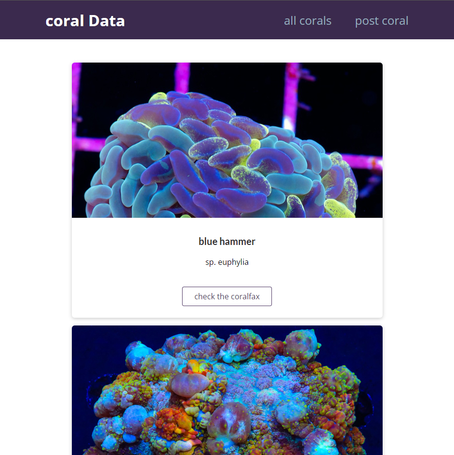
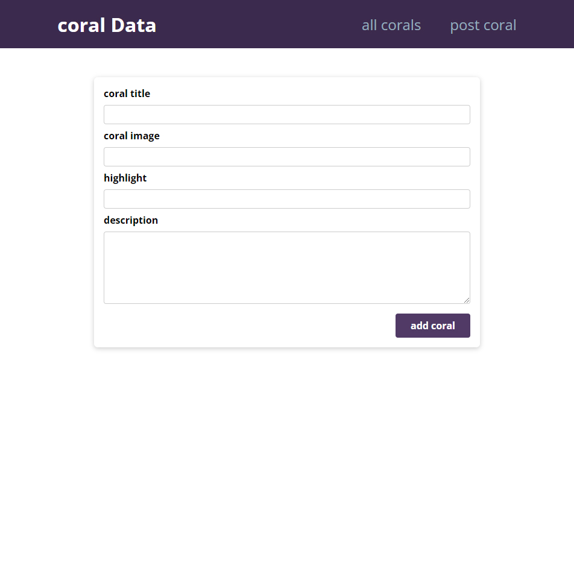

<!-- PROJECT LOGO -->
 

    
    

<h3 align="center">Coral Data</h3>
  

    Data visualization with MongoDB
     
  

<!-- TABLE OF CONTENTS -->

  
Table of Contents

  <ol>
    <li>
      <a href="#about-the-project">About The Project</a>
      <ul>
        <li><a href="#built-with">Built With</a></li>
      </ul>
    </li>
  </ol>

<!-- ABOUT THE PROJECT -->
## About The Project
Exploring MongoDB as a backend. Using POST methods to write to mongo and map updates to the front page.

### Built With

* React
* MongoDB
* Next.js
